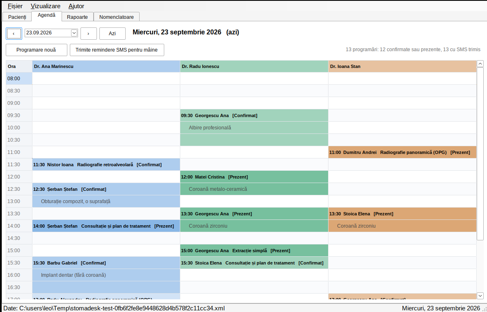
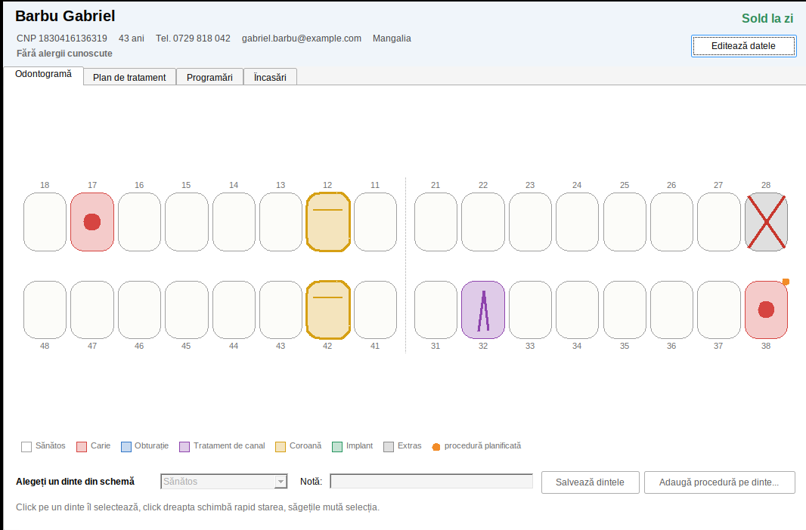
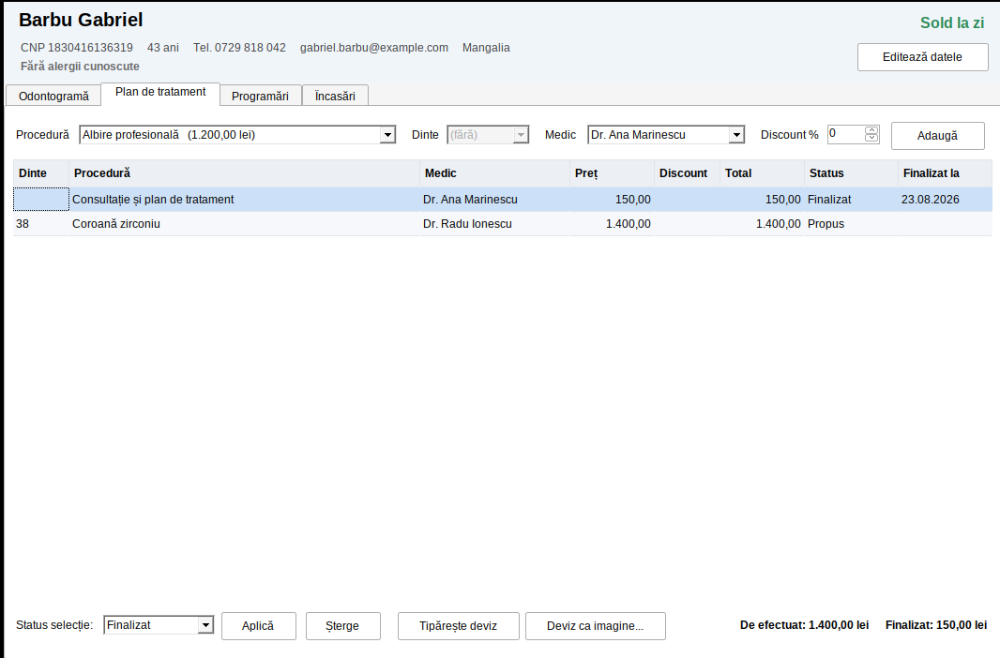

# StomaDesk

Aplicație desktop de gestiune pentru un cabinet stomatologic, scrisă în **C# cu Windows Forms** pe **.NET Framework 4.5**. Este un proiect de exercițiu, construit în stilul produselor iDava (iStoma, iClinic, iStoma LTD). Nu conține cod sau date iDava; toți pacienții sunt fictivi.



## Ce face

| Ecran | Ce conține |
|---|---|
| **Pacienți** | listă cu căutare (nume cu sau fără diacritice, CNP, telefon), sold colorat, ultima vizită |
| **Fișa pacientului** | odontogramă desenată cu GDI+, plan de tratament, deviz tipărit, programări, încasări cu chitanță |
| **Agendă** | zi cu zi, o coloană pe medic, sloturi de 30 de minute, verificarea suprapunerilor, remindere SMS trimise asincron |
| **Rapoarte** | venit pe medic, încasări pe metodă, proceduri frecvente, rata de neprezentare, pacienți cu datorii, export CSV pentru Excel |
| **Nomenclatoare** | medici, listă de prețuri, datele clinicii (editabile direct în grid) |



## De ce .NET Framework 4.5 și C# 5

Am plecat de la ce se știe public despre iDava:

| An | Ce s-a întâmplat |
|---|---|
| 2012 | se înființează iDava Solutions și începe dezvoltarea iStoma |
| după 2012 | apar iClinic (clinici medicale) și iStoma LTD (laboratoare de tehnică dentară), care comunică cu iStoma |
| mai târziu | aplicațiile mobile iOS și Android și programările online |
| 2026 | anunțul de angajare cere **C# Developer, Windows Forms**, deci clientul de desktop este WinForms |

În 2012, uneltele erau acestea:

| An | Visual Studio | .NET Framework | C# |
|---|---|---|---|
| 2010 | VS 2010 | 4.0 | 4 |
| **2012** | **VS 2012** | **4.5** | **5** (async / await) |
| 2015 | VS 2015 | 4.6 | 6 |
| 2017 | VS 2017 | 4.7 | 7.0 până la 7.3 |
| 2019 | VS 2019 | 4.8 | 7.3 rămâne plafonul pe .NET Framework |

Concluzia: codul cel mai vechi din iStoma este foarte probabil C# 5 pe .NET 4.5. Astăzi proiectul rulează cel mai probabil pe .NET Framework 4.7.2 sau 4.8, cu C# 7.3 cel mult, pentru că .NET Framework nu trece oficial de C# 7.3.

De aceea proiectul are `<LangVersion>5</LangVersion>` în `StomaDesk.csproj`: compilatorul refuză orice sintaxă mai nouă. Codul C# 5 compilează în orice Visual Studio mai nou, dar invers nu. Ce **nu** există în C# 5 și vei vedea scris altfel în cod vechi:

| Sintaxă nouă | Versiunea | Cum arată în C# 5 |
|---|---|---|
| string interpolation `$"..."` | C# 6 | `string.Format("{0}", x)` |
| null-conditional `?.` | C# 6 | `x == null ? null : x.Name` |
| `nameof(x)` | C# 6 | textul scris de mână: `"x"` |
| expression-bodied member `=>` | C# 6 | proprietate cu `get { return ...; }` |
| auto-property initializer `{ get; set; } = 5` | C# 6 | valoarea se pune în constructor |
| `out var` | C# 7 | variabila se declară înainte |
| tuple `(a, b)` | C# 7 | o clasă mică sau `out` |
| pattern matching `is Type t` | C# 7 | `as` urmat de verificare la `null` |

## Rulare pe Linux

Este nevoie de .NET SDK (6 sau mai nou) pentru build și de Mono pentru rulare:

```bash
sudo apt install mono-complete      # o singură dată
git clone https://github.com/zigazaga4/StomaDesk.git
cd StomaDesk
./run.sh
```

`run.sh` face build și pornește aplicația cu Mono. Dacă Mono lipsește, încearcă Wine; prima dată Wine cere instalarea pachetului Wine Mono, care se acceptă.

La prima pornire se creează datele demo: 3 medici, 15 proceduri, 13 pacienți și programări pentru trei săptămâni în jurul zilei de azi. Fișierul este:

| Sistem | Fișier |
|---|---|
| Linux cu Mono | `~/.config/StomaDesk/clinic.xml` |
| Windows | `%APPDATA%\StomaDesk\clinic.xml` |

Pentru a reporni cu date demo proaspete, șterge fișierul.

Opțiuni în linia de comandă:

| Comandă | Ce face |
|---|---|
| `./run.sh --data fisier.xml` | lucrează pe alt fișier de date |
| `./run.sh --selftest` | 51 de verificări fără interfață (CNP, căutare, suprapuneri, sold, SMS, rapoarte, desenare); codul de ieșire 0 înseamnă totul în regulă |
| `./run.sh --smoke --out folder` | deschide fiecare fereastră și fiecare tab și salvează câte o captură în folder |

## Rulare pe Windows

Se deschide `StomaDesk.sln` în Visual Studio 2019 sau 2022 și se apasă F5. Formularele au fișiere `.Designer.cs` scrise în formatul designerului, deci se deschid și în editorul vizual.

## Structura proiectului

```
src/StomaDesk/
  Models/        clasele de date: Patient, Appointment, TreatmentItem, Payment, Doctor, Procedure
  Data/          ClinicStore (toate regulile și salvarea), XmlClinicFile, SampleData
  Services/      CNP, telefon, formatare, remindere SMS, rapoarte, deviz (GDI+ și tipărire)
  Controls/      OdontogramControl, controlul desenat de mână
  Forms/         ferestrele și tab-urile, fiecare cu fișierul lui .Designer.cs
  Ui/            ajutoare comune pentru DataGridView, ComboBox, mesaje, culori
  Diagnostics/   self-test, smoke test, jurnal de erori
```

## Ce exersează, legat de munca la un produs ca iStoma

| Subiect | Unde în cod |
|---|---|
| fișiere Designer, `InitializeComponent`, evenimente legate în designer | `Forms/*.Designer.cs` |
| `DataGridView` needitabil cu `Tag` pe rând și editabil legat la `BindingList<T>` | `Ui/Grid.cs`, `Forms/SettingsView.cs` |
| control personalizat: `OnPaint`, hit test, tastatură, `ToolTip`, `ContextMenuStrip` | `Controls/OdontogramControl.cs` |
| validare cu `ErrorProvider`, CNP verificat în timp ce se tastează | `Forms/PatientForm.cs`, `Services/Cnp.cs` |
| `async` / `await`, `Task.Run`, `IProgress<T>`, `CancellationToken` fără să blocheze UI thread | `Forms/AgendaView.cs`, `Services/Reminders.cs` |
| `Timer` pentru căutare cu întârziere (debounce) | `Forms/PatientsView.cs` |
| `PrintDocument` și `PrintPreviewDialog`, același desen salvat și ca PNG | `Services/Estimate.cs` |
| `XmlSerializer` cu salvare atomică (fișier temporar, apoi `File.Replace`) | `Data/XmlClinicFile.cs` |
| reguli de business într-un singur loc, nu în ferestre | `Data/ClinicStore.cs` |
| formatare românească independentă de setările Windows | `Services/Fmt.cs` |


