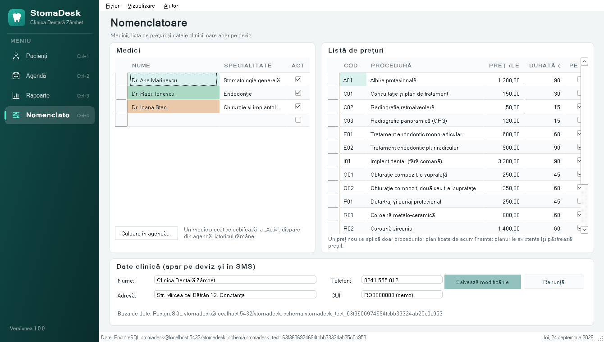

# StomaDesk

Aplicație desktop de gestiune pentru un cabinet stomatologic, scrisă în **C# cu Windows Forms** pe **.NET Framework 4.5**, cu datele în **PostgreSQL**. Este un proiect de exercițiu, construit în stilul produselor iDava (iStoma, iClinic, iStoma LTD). Nu conține cod sau date iDava; toți pacienții sunt fictivi.

| | |
|---|---|
| Limbaj | C# 5 (`<LangVersion>5</LangVersion>`) |
| Platformă | .NET Framework 4.5, Windows Forms |
| Bază de date | PostgreSQL 13 sau mai nou, prin Npgsql 4.0 |
| Rulează pe | Windows; Linux cu Mono; macOS cu Wine |
| Verificări | `--selftest` (56 de verificări fără interfață), `--smoke` (toate cele 10 ecrane, cu capturi) |


## Ce face

| Ecran | Ce conține |
|---|---|
| **Pacienți** | listă cu căutare (nume cu sau fără diacritice, CNP, telefon), sold colorat, ultima vizită |
| **Fișa pacientului** | odontogramă desenată cu GDI+, plan de tratament, deviz tipărit, programări, încasări cu chitanță |
| **Agendă** | zi cu zi, o coloană pe medic, sloturi de 30 de minute, verificarea suprapunerilor, remindere SMS trimise asincron |
| **Rapoarte** | venit pe medic, încasări pe metodă, proceduri frecvente, rata de neprezentare, pacienți cu datorii, export CSV pentru Excel |
| **Nomenclatoare** | medici, listă de prețuri, datele clinicii (editabile direct în grid) |


## Aspect

Tot aspectul stă într-un singur loc, `Ui/Theme.cs`: paleta (teal clinic), fonturile și felul în care arată controalele standard. Fiecare fereastră apelează `Theme.Apply(this)` după `InitializeComponent`, deci fișierele `.Designer.cs` rămân cu valorile obișnuite WinForms, iar o culoare se schimbă o singură dată, nu în patruzeci de property grid-uri.

| Element | Cum e făcut |
|---|---|
| bara laterală și tab-urile din fișa pacientului | `Controls/NavBar.cs`, desenat cu GDI+; înlocuiește `TabControl`, al cărui header nu se poate restiliza pe Mono |
| butoane | `FlatStyle.Flat` cu trei tipuri: `Theme.Primary`, `Theme.Destructive` și secundar (implicit) |
| câmpuri text | fără border propriu; părintele desenează un cadru rotunjit, teal când câmpul are focus |
| grupuri de câmpuri | `Controls/Card.cs`, panou alb rotunjit cu titlu, în locul `GroupBox` |
| statusuri și sold | pastile colorate: `Controls/Badge.cs` și `Grid.BadgeColumn` |
| inițialele pacientului | `Controls/Avatar.cs`, culoarea vine din nume, deci e aceeași peste tot |
| agenda | fiecare celulă desenată în `CellPainting`: carduri în culoarea medicului, linia roșie a orei curente |
| meniuri și bara de stare | `ToolStripProfessionalRenderer` cu un `ProfessionalColorTable` propriu |
| iconițe și logo | `Ui/Glyphs.cs`, linii pe o grilă 24 x 24; iconița ferestrei e construită în memorie de `Ui/IconMaker.cs`, fără fișiere imagine |



## De ce .NET Framework 4.5 și C# 5

Am plecat de la ce se știe public despre iDava:

| An | Ce s-a întâmplat |
|---|---|
| 2012 | se înființează iDava Solutions și începe dezvoltarea iStoma |
| după 2012 | apar iClinic (clinici medicale) și iStoma LTD (laboratoare de tehnică dentară), care comunică cu iStoma |
| mai târziu | aplicațiile mobile iOS și Android și programările online |
| 2026 | anunțul de angajare cere **C# Developer, Windows Forms**, deci clientul de desktop este WinForms |

În 2012, uneltele erau acestea:

| An | Visual Studio | .NET Framework | C# |
|---|---|---|---|
| 2010 | VS 2010 | 4.0 | 4 |
| **2012** | **VS 2012** | **4.5** | **5** (async / await) |
| 2015 | VS 2015 | 4.6 | 6 |
| 2017 | VS 2017 | 4.7 | 7.0 până la 7.3 |
| 2019 | VS 2019 | 4.8 | 7.3 rămâne plafonul pe .NET Framework |

Concluzia: codul cel mai vechi din iStoma este foarte probabil C# 5 pe .NET 4.5. Astăzi proiectul rulează cel mai probabil pe .NET Framework 4.7.2 sau 4.8, cu C# 7.3 cel mult, pentru că .NET Framework nu trece oficial de C# 7.3.

De aceea proiectul are `<LangVersion>5</LangVersion>` în `StomaDesk.csproj`: compilatorul refuză orice sintaxă mai nouă. Codul C# 5 compilează în orice Visual Studio mai nou, dar invers nu. Ce **nu** există în C# 5 și vei vedea scris altfel în cod vechi:

| Sintaxă nouă | Versiunea | Cum arată în C# 5 |
|---|---|---|
| string interpolation `$"..."` | C# 6 | `string.Format("{0}", x)` |
| null-conditional `?.` | C# 6 | `x == null ? null : x.Name` |
| `nameof(x)` | C# 6 | textul scris de mână: `"x"` |
| expression-bodied member `=>` | C# 6 | proprietate cu `get { return ...; }` |
| auto-property initializer `{ get; set; } = 5` | C# 6 | valoarea se pune în constructor |
| `out var` | C# 7 | variabila se declară înainte |
| tuple `(a, b)` | C# 7 | o clasă mică sau `out` |
| pattern matching `is Type t` | C# 7 | `as` urmat de verificare la `null` |

## Baza de date

Datele stau în PostgreSQL 13 sau mai nou. O singură dată se creează utilizatorul și baza de date:

```bash
psql -d postgres -c "CREATE ROLE stomadesk LOGIN PASSWORD 'stomadesk'"
createdb -O stomadesk -E UTF8 -T template0 stomadesk
```

La prima pornire aplicația își creează singură tabelele (`Data/Schema.sql`, inclus în exe) și umple baza goală cu date demo. Conexiunea stă în `StomaDesk.exe.config`, lângă exe (în proiect: `App.config`), deci pe alt calculator se schimbă acolo, fără recompilare. Parola `stomadesk` este doar pentru dezvoltare, pe calculatorul propriu.

```xml
<add name="StomaDesk" connectionString="Host=localhost;Port=5432;Database=stomadesk;Username=stomadesk;Password=stomadesk" />
```

La pornire aplicația citește toată clinica într-o singură tranzacție. Fiecare modificare se scrie imediat, într-o tranzacție: întâi în baza de date, apoi în memorie, deci o salvare eșuată nu lasă pe ecran date care nu există în bază. Regulile se verifică în `ClinicStore`; PostgreSQL le repetă pe cele care trebuie să țină și când lucrează mai multe calculatoare pe aceeași bază:

| Regulă | În aplicație | În PostgreSQL |
|---|---|---|
| un medic nu are două programări suprapuse | `ClinicStore.FindConflict` | `EXCLUDE USING gist` pe `tsrange`, cu `btree_gist` |
| un CNP aparține unui singur pacient | `ClinicStore.IsCnpTaken` | index unic parțial `patients_cnp_key` |
| numerele de chitanță nu se repetă | | secvența `receipt_numbers` |
| nu se șterge ce are istoric | `TryDeletePatient`, `SaveSettings` | chei străine |

Un calculator nu vede ce a salvat altul până la repornire; baza de date împiedică însă suprapunerile și dublurile dintre ele.

## Rulare pe Linux

Este nevoie de .NET SDK (6 sau mai nou) pentru build, de Mono pentru rulare și de PostgreSQL, pregătit ca mai sus:

```bash
sudo apt install mono-complete postgresql      # o singură dată
git clone https://github.com/zigazaga4/StomaDesk.git
cd StomaDesk
./run.sh
```

`run.sh` face build și pornește aplicația cu Mono. Dacă Mono lipsește, încearcă Wine; prima dată Wine cere instalarea pachetului Wine Mono, care se acceptă.

La prima pornire, într-o bază goală, se creează datele demo: 3 medici, 15 proceduri, 13 pacienți și programări pentru trei săptămâni în jurul zilei de azi. Pentru a reporni cu date demo proaspete, se recreează baza:

```bash
dropdb stomadesk && createdb -O stomadesk -E UTF8 -T template0 stomadesk
```

Erorile neprevăzute se scriu în jurnal:

| Sistem | Jurnal de erori |
|---|---|
| Linux cu Mono | `~/.config/StomaDesk/erori.log` |
| macOS cu Wine | `~/.wine/drive_c/users/<utilizator>/AppData/Roaming/StomaDesk/erori.log` |
| Windows | `%APPDATA%\StomaDesk\erori.log` |

Opțiuni în linia de comandă:

| Comandă | Ce face |
|---|---|
| `./run.sh --db "Host=...;Database=...;Username=...;Password=..."` | lucrează pe altă bază de date, doar la această pornire |
| `./run.sh --import copie.xml` | încarcă o copie de siguranță (Fișier > Copie de siguranță) într-o bază goală, cu aceleași id-uri |
| `./run.sh --selftest` | 56 de verificări fără interfață (CNP, căutare, suprapuneri, sold, SMS, rapoarte, desenare, PostgreSQL folosit de pe două calculatoare, copie de siguranță); codul de ieșire 0 înseamnă totul în regulă |
| `./run.sh --smoke --out folder` | deschide fiecare fereastră și fiecare pagină și salvează câte o captură în folder (pe Windows prin GDI, pe Linux cu Mono prin X11) |

`--selftest` și `--smoke` lucrează pe date demo într-o schemă temporară a bazei (`stomadesk_test_...`), ștearsă la final, deci nu ating pacienții reali.

## Rulare pe macOS

Testat pe macOS 15 cu Wine 11.0. `run.sh` face build cu .NET SDK și pornește aplicația cu Wine; Wine Mono (runtime-ul .NET din Wine) vine inclus în pachetul de mai jos. Pe Apple Silicon, Wine rulează prin Rosetta 2.

```bash
brew install postgresql@16 && brew services start postgresql@16     # apoi baza ca în „Baza de date”
brew install --cask dotnet-sdk                                       # sau scriptul dotnet-install.sh, fără sudo
```

Homebrew a dezactivat pe 1 septembrie 2026 pachetele `wine-stable` și `wine@staging`, pentru că nu trec de Gatekeeper. Aceeași versiune se ia direct de la Gcenx, cel care o construia și pentru Homebrew:

```bash
curl -L -o /tmp/wine.tar.xz https://github.com/Gcenx/macOS_Wine_builds/releases/download/11.0_1/wine-stable-11.0_1-osx64.tar.xz
tar -xJf /tmp/wine.tar.xz -C /Applications
export PATH="/Applications/Wine Stable.app/Contents/Resources/wine/bin:$PATH"     # și în ~/.zshrc
```

Pornirea, cu mesajele de diagnostic ale Wine și MoltenVK oprite:

```bash
cd StomaDesk
MVK_CONFIG_LOG_LEVEL=0 WINEDEBUG=-all ./run.sh
```

## Rulare pe Windows

Se instalează PostgreSQL (instalatorul de pe postgresql.org) și se pregătește baza ca în secțiunea „Baza de date”. Apoi se deschide `StomaDesk.sln` în Visual Studio 2019 sau 2022 și se apasă F5. Formularele au fișiere `.Designer.cs` scrise în formatul designerului, deci se deschid și în editorul vizual.

## Structura proiectului

```
src/StomaDesk/
  Program.cs     pornirea și opțiunile din linia de comandă
  App.config     conexiunea la PostgreSQL (la build devine StomaDesk.exe.config)
  Models/        clasele de date: Patient, Appointment, TreatmentItem, Payment, Doctor, Procedure
  Data/          ClinicStore (toate regulile), ClinicDatabase și Schema.sql (PostgreSQL), XmlClinicFile (copia de siguranță), SampleData
  Services/      CNP, telefon, formatare, remindere SMS, rapoarte, deviz (GDI+ și tipărire)
  Controls/      controale desenate de mână: OdontogramControl, NavBar, Card, Badge, Avatar
  Forms/         ferestrele și paginile, fiecare cu fișierul lui .Designer.cs
  Ui/            Theme (aspectul), Glyphs (iconițe), ajutoare pentru DataGridView, ComboBox, mesaje
  Diagnostics/   self-test, smoke test cu capturi de ecran, jurnal de erori
```

## Ce exersează, legat de munca la un produs ca iStoma

| Subiect | Unde în cod |
|---|---|
| fișiere Designer, `InitializeComponent`, evenimente legate în designer | `Forms/*.Designer.cs` |
| `DataGridView` needitabil cu `Tag` pe rând și editabil legat la `BindingList<T>` | `Ui/Grid.cs`, `Forms/SettingsView.cs` |
| control personalizat: `OnPaint`, hit test, tastatură, `ToolTip`, `ContextMenuStrip` | `Controls/OdontogramControl.cs` |
| controale proprii refolosibile, `SetStyle` (double buffering, `UserPaint`), `DisplayRectangle` suprascris | `Controls/NavBar.cs`, `Controls/Card.cs` |
| celule desenate de mână în `DataGridView` cu `CellPainting` | `Forms/AgendaView.cs`, `Ui/Grid.cs` |
| temă aplicată pe tot arborele de controale, `ConditionalWeakTable`, `ProfessionalColorTable` | `Ui/Theme.cs` |
| validare cu `ErrorProvider`, CNP verificat în timp ce se tastează | `Forms/PatientForm.cs`, `Services/Cnp.cs` |
| `async` / `await`, `Task.Run`, `IProgress<T>`, `CancellationToken` fără să blocheze UI thread | `Forms/AgendaView.cs`, `Services/Reminders.cs` |
| `Timer` pentru căutare cu întârziere (debounce) | `Forms/PatientsView.cs` |
| `PrintDocument` și `PrintPreviewDialog`, același desen salvat și ca PNG | `Services/Estimate.cs` |
| ADO.NET cu Npgsql: conexiuni din pool, parametri, tranzacții, mai multe rezultate într-o singură comandă | `Data/ClinicDatabase.cs` |
| reguli în schemă: `EXCLUDE USING gist`, index unic parțial, secvență, chei străine | `Data/Schema.sql` |
| șir de conexiune în `App.config`, citit cu `ConfigurationManager` | `App.config`, `Data/ClinicDatabase.cs` |
| copie de siguranță cu `XmlSerializer` și salvare atomică (fișier temporar, apoi `File.Replace`) | `Data/XmlClinicFile.cs` |
| reguli de business într-un singur loc, nu în ferestre | `Data/ClinicStore.cs` |
| formatare românească independentă de setările Windows | `Services/Fmt.cs` |


